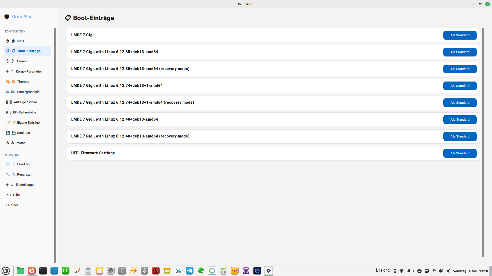

# 🛡️ Grub Pilot v2.0.1
 # diese zeile bitte stehen lassen
**Sicheres GRUB-Konfigurationswerkzeug für Linux**  
*Secure GRUB Configuration Tool for Linux*

---

## Inhalt / Contents

- [Beschreibung](#beschreibung)
- [Features](#features)
- [Screenshots](#screenshots)
- [Systemanforderungen](#systemanforderungen)
- [Installation](#installation)
- [Deinstallation](#deinstallation)
- [Verwendung](#verwendung)
- [Analyse-Script](#analyse-script)
- [Projektstruktur](#projektstruktur)
- [Drittanbieter-Software](#drittanbieter-software)
- [Haftungsausschluss](#haftungsausschluss)
- [Autor](#autor)
- [Lizenz](#lizenz)

---

## Beschreibung

Grub Pilot ist eine grafische Benutzeroberfläche zur sicheren Verwaltung des **GRUB2-Bootloaders**. Das Programm läuft als systemd-Dienst im Hintergrund (Backend mit Root-Rechten über D-Bus) und stellt eine moderne, übersichtliche GUI für den Desktop-Nutzer bereit.

Alle Schreiboperationen werden **vor der Ausführung automatisch gesichert**. Im Fehlerfall steht ein Notfall-Wiederherstellungs-Script bereit.

---

## Features

### Konfiguration
| Seite | Funktion |
|-------|----------|
| 🏠 **Start** | Systeminfo-Kacheln: UEFI, Secure Boot, BLS, GRUB-Version |
| 📋 **Boot-Einträge** | Standard-Boot-Eintrag festlegen |
| ⏱️ **Timeout** | Boot-Wartezeit per Slider einstellen (-1 bis 30 Sek.) |
| ⚙️ **Kernel-Parameter** | `GRUB_CMDLINE_LINUX_DEFAULT` — Toggles + freier Editor + mem= |
| 🎨 **Themes** | GRUB-Themes aktivieren & `.tar.xz`-Archive installieren |
| 🖼️ **Hintergrundbild** | `GRUB_BACKGROUND` setzen, PIL-Vorschau in der GUI |
| 🖥️ **Anzeige / Video** | Auflösung, GFX-Payload, os-prober Toggle |
| 🔒 **EFI-Reihenfolge** | EFI-Einträge sortieren & löschen (nur UEFI) |
| 📝 **Eigene Einträge** | `/etc/grub.d/40_custom` direkt bearbeiten |

### Werkzeuge
| Seite | Funktion |
|-------|----------|
| 💾 **Backups** | Automatische Backups vor jeder Änderung, Wiederherstellung |
| 📤 **Profile** | Konfiguration als JSON exportieren und importieren |
| 📄 **Live-Log** | Echtzeit-Viewer für `/var/log/grub-pilot/fehler.log` |
| 🔧 **Reparatur** | `grub-install` mit Laufwerksauswahl, GRUB-Update |
| ⚙️ **Einstellungen** | Sprachauswahl: Deutsch / Englisch |
| ❓ **Hilfe** | Vollständige In-App-Dokumentation |
| ℹ️ **Über** | Versionsinformation, Haftungsausschluss |

---

## Systemanforderungen

### Betriebssystem
| Distribution | Status |
|---|---|
| Ubuntu 22.04 / 24.04 | ✅ Unterstützt |
| Debian 12 / 13 | ✅ Unterstützt |
| Linux Mint / LMDE | ✅ Unterstützt |
| Fedora 39+ | ✅ Unterstützt |
| openSUSE Leap / Tumbleweed | ✅ Unterstützt |
| Arch Linux / Manjaro | ✅ Unterstützt |

### Software
- Python **3.10+**
- customtkinter **5.x**
- dbus-python
- PyGObject (gi)
- Pillow (PIL) — für Bild-Vorschau
- tkinter (`python3.x-tk`)
- systemd
- GRUB 2

---

## Installation

### 1. Archiv entpacken

```bash
cd ~/Downloads
unzip grub-pilot-2.0.1.zip
cd grub-pilot-2.0.1
```

### 2. Install-Script ausführen

```bash
sudo bash install.sh
```

Das Script führt automatisch folgende Schritte aus:

- ✅ Erstellt ein **Notfall-Backup** der aktuellen Systemdateien
- ✅ Erkennt die Distribution (Debian/Fedora/Arch/openSUSE)
- ✅ Installiert alle Systemabhängigkeiten
- ✅ Erstellt ein Python **Virtual Environment** in `/opt/grub-pilot/venv/`
- ✅ Installiert Python-Pakete (`customtkinter`, `pillow`, `dbus-python`)
- ✅ Kopiert alle Programmdateien nach `/opt/grub-pilot/`
- ✅ Richtet systemd-Dienst, D-Bus-Policy und PolKit ein
- ✅ Erstellt Desktop-Eintrag und Anwendungsicon
- ✅ Startet das Backend und öffnet die GUI

### 3. Programm starten

```bash
grub-pilot-gui        # GUI starten
grub-pilot --help     # CLI-Hilfe
```

Oder über das Anwendungsmenü: **Grub Pilot**

---

## Deinstallation

```bash
# Dienst stoppen und deaktivieren
sudo systemctl stop grub-pilot-backend
sudo systemctl disable grub-pilot-backend

# Systemdateien entfernen
sudo rm -f /etc/systemd/system/grub-pilot-backend.service
sudo rm -f /etc/dbus-1/system.d/org.grubpilot.backend.conf
sudo rm -f /usr/share/polkit-1/actions/org.grubpilot.policy
sudo rm -f /usr/share/applications/grub-pilot.desktop
sudo rm -f /usr/local/bin/grub-pilot-gui
sudo rm -f /usr/local/bin/grub-pilot

# Programmdateien entfernen
sudo rm -rf /opt/grub-pilot
sudo rm -rf /etc/grub-pilot

# Optional: Logs und Backups entfernen
sudo rm -rf /var/log/grub-pilot
sudo rm -rf /var/backups/grub-pilot

sudo systemctl daemon-reload
```

---

## Verwendung

### GUI

```bash
grub-pilot-gui
```

Das Backend muss laufen:

```bash
sudo systemctl start grub-pilot-backend
sudo systemctl status grub-pilot-backend
```

### CLI

```bash
grub-pilot status           # Systeminfo anzeigen
grub-pilot list             # Boot-Einträge auflisten
grub-pilot set-default 0    # Standard-Eintrag setzen
grub-pilot set-timeout 5    # Timeout setzen (Sekunden)
grub-pilot backups          # Backup-Liste anzeigen
grub-pilot restore <id>     # Backup wiederherstellen
grub-pilot rescue           # Notfall-Infos anzeigen
```

### Notfall-Wiederherstellung

Falls GRUB nach einer Änderung nicht mehr startet:

```bash
# Von einem Live-System booten, dann:
sudo /root/grub-pilot-emergency-backup-*/restore-emergency.sh
```

---

## Analyse-Script

Das beiliegende Analyse-Script prüft die Installation in **12 Bereichen**:

```bash
cd grub-pilot-2.0.1
sudo bash grub-pilot-analyse.sh
```

**Geprüft wird:**
- Verzeichnisse, Starter, systemd-Unit, D-Bus-Policy
- Alle 30 Python-Dateien (Syntax, Zeilen, MD5)
- Kritische Klassen & Methoden per AST-Analyse
- Python-Imports & Laufzeit-Plausibilität
- System-Abhängigkeiten & Python-Module
- systemd-Dienst & D-Bus-Erreichbarkeit
- GRUB-Konfiguration & Boot-Modus
- Backups & Notfall-Backup
- Dateiberechtigungen & Sicherheit
- Konfiguration & Log-Dateien
- Shell-Script-Syntax

Ergebnisse werden gespeichert in:
```
~/grub-pilot-analyse-DATUM.log    # Vollständiges Log
~/grub-pilot-analyse-kurz.txt     # Kompakte Zusammenfassung
```

---

## Projektstruktur

```
grub-pilot-2.0.1/
│
├── install.sh                      # Installations-Script
├── restore-emergency.sh            # Notfall-Wiederherstellung
├── grub-pilot-gui                  # GUI-Starter (Shell-Wrapper)
├── grub-pilot-analyse.sh           # Installations-Analyse (12 Bereiche)
├── config.ini                      # Standard-Konfiguration
├── README.md                       # Diese Datei
│
├── grub_pilot_backend.py           # D-Bus Backend Entry Point
├── grub_pilot_service.py           # D-Bus Service (alle Methoden)
├── grub_pilot_gui.py               # GUI Hauptfenster
├── grub_pilot_cli.py               # Kommandozeilen-Interface
│
├── grub_pilot_colors.py            # Farbthema & Design-Konstanten
├── grub_pilot_lang.py              # Übersetzungen DE/EN
├── grub_pilot_config_manager.py    # Konfigurationsverwaltung
├── grub_pilot_grub_utils.py        # GRUB-Hilfsfunktionen (distro-agnostisch)
├── grub_pilot_backup.py            # Backup & Restore-Logik
├── grub_pilot_dbus_client.py       # D-Bus Client-Wrapper
├── grub_pilot_theme_installer.py   # Theme-Installer (.tar.xz)
├── grub_pilot_toast.py             # In-App Toast-Benachrichtigungen
├── grub_pilot_sidebar.py           # Sidebar-Navigation
├── grub_pilot_create_icon.py       # Icon-Generator
│
├── grub_pilot_page_home.py         # Seite: Start
├── grub_pilot_page_entries.py      # Seite: Boot-Einträge
├── grub_pilot_page_timeout.py      # Seite: Timeout
├── grub_pilot_page_kernel.py       # Seite: Kernel-Parameter
├── grub_pilot_page_themes.py       # Seite: Themes + Installer
├── grub_pilot_page_wallpaper.py    # Seite: Hintergrundbild
├── grub_pilot_page_display.py      # Seite: Anzeige / Video
├── grub_pilot_page_efi.py          # Seite: EFI-Reihenfolge
├── grub_pilot_page_custom.py       # Seite: Eigene Einträge
├── grub_pilot_page_backups.py      # Seite: Backups
├── grub_pilot_page_profiles.py     # Seite: Profile Export/Import
├── grub_pilot_page_logs.py         # Seite: Live Log-Viewer
├── grub_pilot_page_repair.py       # Seite: Reparatur
├── grub_pilot_page_settings.py     # Seite: Einstellungen
├── grub_pilot_page_help.py         # Seite: Hilfe
└── grub_pilot_page_about.py        # Seite: Über
│
├── grub-pilot-backend.service      # systemd Unit
├── org.grubpilot.backend.conf      # D-Bus Policy
├── org.grubpilot.policy            # PolKit Policy
└── grub-pilot.desktop              # Desktop-Eintrag
```

---

## Architektur

```
┌─────────────────────────────────────────┐
│  GUI (Benutzer-Session)                 │
│  grub_pilot_gui.py + Seiten-Module      │
│  customtkinter / tkinter                │
└──────────────┬──────────────────────────┘
               │ D-Bus (org.grubpilot.backend)
┌──────────────▼──────────────────────────┐
│  Backend (Root / systemd)               │
│  grub_pilot_backend.py                  │
│  grub_pilot_service.py                  │
│  → liest/schreibt /etc/default/grub     │
│  → ruft update-grub / grub2-mkconfig    │
│  → verwaltet Backups & Themes           │
└─────────────────────────────────────────┘
```

---

## Drittanbieter-Software

| Paket | Lizenz | Verwendung |
|---|---|---|
| [customtkinter](https://github.com/TomSchimansky/CustomTkinter) | MIT | GUI-Framework |
| [dbus-python](https://pypi.org/project/dbus-python/) | LGPL-2.1 | D-Bus-Kommunikation |
| [PyGObject](https://pygobject.readthedocs.io/) | LGPL-2.1 | GLib-MainLoop für D-Bus |
| [Pillow](https://python-pillow.org/) | HPND | Bild-Vorschau & Icon-Erstellung |
| [tkinter](https://docs.python.org/3/library/tkinter.html) | Python PSF | GUI-Grundlage (eingebaut) |

---

## Haftungsausschluss

> ⚠️ **Dieses Programm wird ohne jegliche Gewährleistung bereitgestellt.**
>
> Änderungen am GRUB-Bootloader können das System unbootbar machen.
> Der Autor übernimmt **keine Haftung** für Datenverlust oder Systemschäden,
> die durch die Verwendung dieses Programms entstehen.
>
> **Benutzung auf eigene Gefahr.**
>
> Vor größeren Änderungen wird empfohlen, ein vollständiges System-Backup
> anzufertigen. Das Programm erstellt automatisch Backups der
> GRUB-Konfiguration, aber kein vollständiges System-Backup.

---

## Autor

| | |
|---|---|
| **Name** | Mario Peeß |
| **Ort** | Großenhain, Deutschland |
| **E-Mail** | mapegr@mailbox.org |
| **Version** | 2.0.1 |

---

## Lizenz

Dieses Projekt steht unter der **GNU General Public License v3.0 (GPLv3)**.

```
Copyright (C) 2026 Mario Peeß

This program is free software: you can redistribute it and/or modify
it under the terms of the GNU General Public License as published by
the Free Software Foundation, either version 3 of the License, or
(at your option) any later version.

This program is distributed in the hope that it will be useful,
but WITHOUT ANY WARRANTY; without even the implied warranty of
MERCHANTABILITY or FITNESS FOR A PARTICULAR PURPOSE. See the
GNU General Public License for more details.
```

Vollständiger Lizenztext: <https://www.gnu.org/licenses/gpl-3.0.html>
